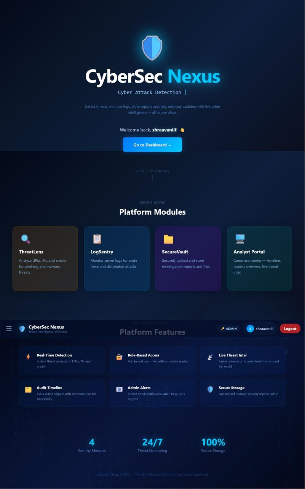
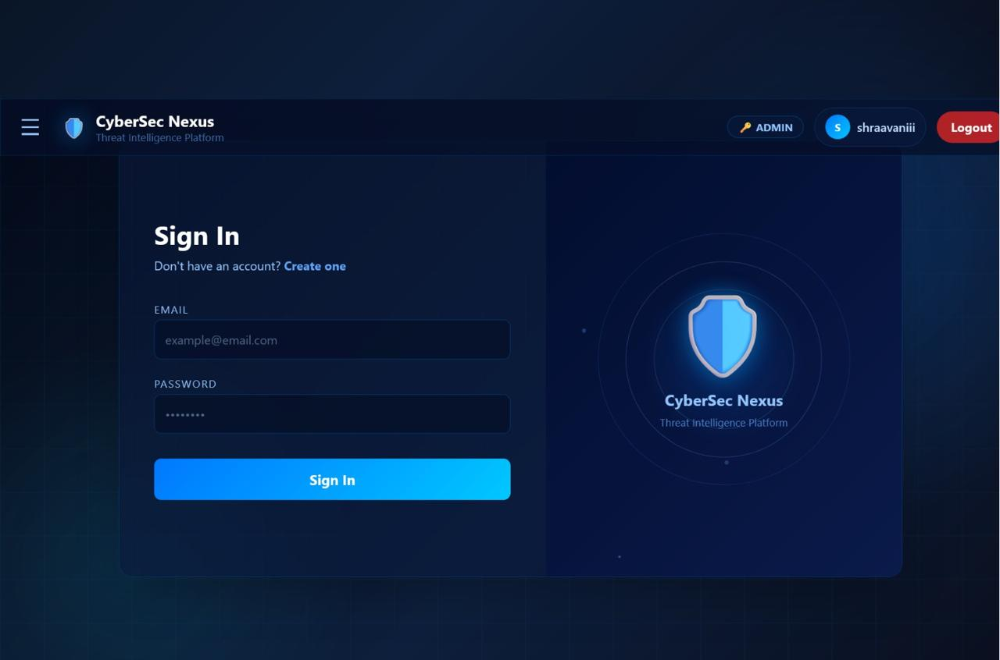
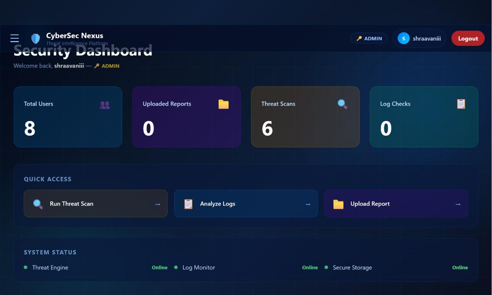
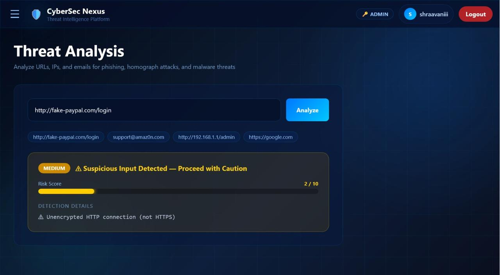
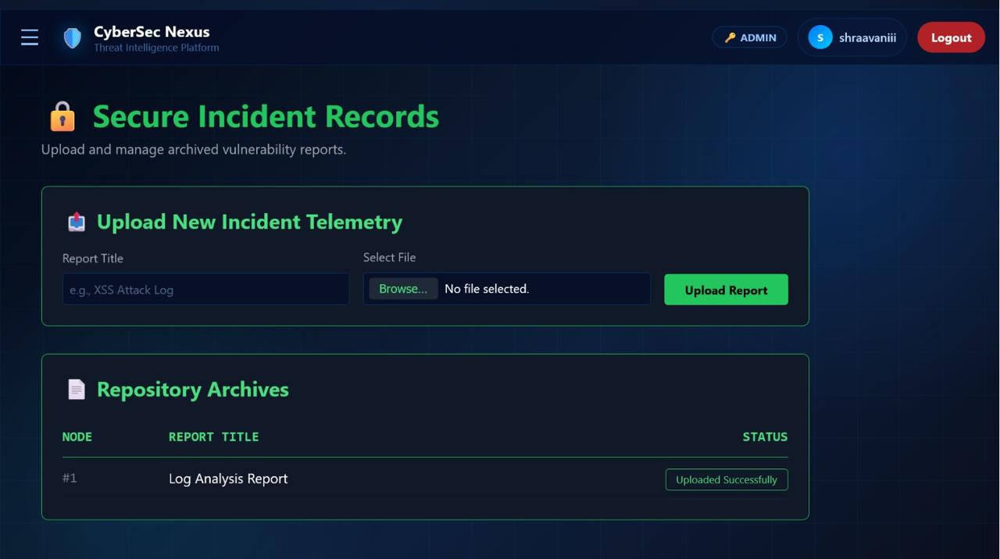
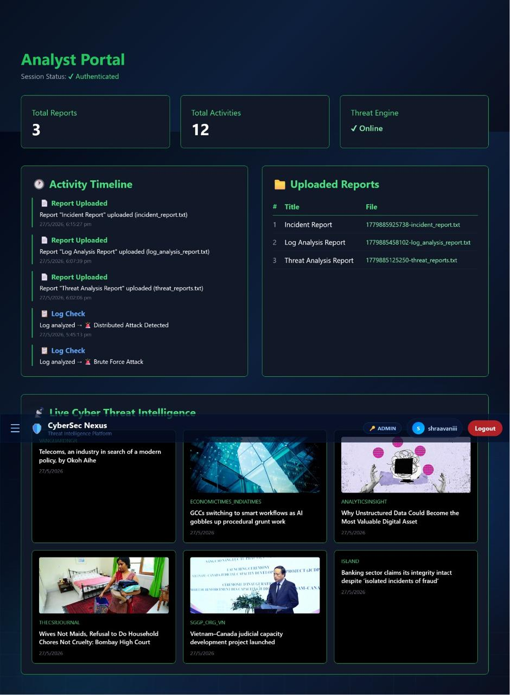

# 🛡️ CyberSec Nexus

### Threat Intelligence & Security Operations Dashboard

CyberSec Nexus is a full-stack cybersecurity platform that brings multiple security operations into a single dashboard. It provides tools for analyzing suspicious URLs, emails and IP addresses, detecting attacks in server logs, managing security reports, monitoring audit activity, and viewing cybersecurity news.

The project was developed as an **Advanced Web Technology (AWT)** project using React.js, Node.js, Express.js and PostgreSQL, and is deployed using Vercel and Render.

---

## 🚀 Live Demo

**Frontend:** https://cybersec-nexus-frontend.onrender.com

**Backend API:** https://cybersec-nexus-backend.onrender.com

> ⚠️ The backend is hosted on Render's free tier, so the first request may take some time if the service has been inactive.

---

## 📌 Features

* 🔐 User registration and login
* 🔑 Password hashing using bcryptjs
* 👥 Role-based access control
* 🎯 Suspicious URL, email and IP analysis
* 📊 Server log attack detection
* 📁 Security report upload and management
* 📝 Audit activity logging
* 👨‍💻 Admin-only Analyst Portal
* 📰 Live cybersecurity news integration
* 📧 Automated admin email alerts
* 📱 Responsive cybersecurity dashboard
* ☁️ Cloud deployment using Vercel and Render

---

## 🧩 Main Modules

### 🔐 1. Authentication

Provides secure registration and login functionality.

**Implemented features:**

* User registration
* User login
* Password hashing with `bcryptjs`
* Role-based access control
* Protected routes
* Local session management
* Admin registration alerts using Nodemailer

---

### 🎯 2. ThreatLens

ThreatLens analyzes suspicious URLs, email addresses and IP addresses using **rule-based heuristic detection**.

It checks for patterns such as:

| Detection         | Example                | Risk |
| ----------------- | ---------------------- | ---: |
| HTTP URL          | `http://example.com`   |   +2 |
| Homograph attack  | `paypaI.com`           |   +3 |
| Typosquatting     | `amaz0n.com`           |   +3 |
| Suspicious TLD    | `.xyz`, `.ru`, `.tk`   |   +1 |
| IP-based URL      | `http://192.168.1.1`   |   +3 |
| Phishing email    | `support@paypa1.com`   |   +2 |
| Lure words        | `free`, `bonus`, `win` |   +1 |
| Excessive hyphens | `pay-pal-secure.com`   |   +2 |

### Risk Levels

| Score | Severity    |
| ----: | ----------- |
|   0–1 | 🟢 LOW      |
|   2–3 | 🟡 MEDIUM   |
|   4–5 | 🟠 HIGH     |
|    6+ | 🔴 CRITICAL |

> **Important:** ThreatLens is a rule-based/heuristic system. It does not claim to replace real-time threat intelligence platforms or machine-learning-based phishing detection.

---

### 📊 3. LogSentry

LogSentry analyzes server logs line-by-line and identifies common attack patterns.

| Attack              | Detection                                |
| ------------------- | ---------------------------------------- |
| Brute Force         | Multiple failed login attempts           |
| Distributed Attack  | Multiple IPs generating failures         |
| DDoS                | High request volume from multiple IPs    |
| SQL Injection       | SQL injection patterns                   |
| XSS                 | Script and JavaScript injection patterns |
| Port Scan           | `nmap`, SYN scan, `masscan` patterns     |
| Unauthorized Access | Unauthorized/access-denied patterns      |

Detected threats are displayed with severity levels and the corresponding log line numbers.

---

### 📁 4. SecureReports

SecureReports provides a basic security report management system.

Users can:

* Upload security reports
* Provide report titles
* Store uploaded files on the backend
* Store report metadata in PostgreSQL
* Record upload activity in the audit log

File uploads are handled using **Multer**.

---

### 👨‍💻 5. Analyst Portal

The Analyst Portal is restricted to users with the `admin` role.

It provides:

* 📈 Activity statistics
* 📝 Audit activity timeline
* 📁 Uploaded reports
* 📰 Live cybersecurity news
* 👥 Platform activity monitoring

---

### 📊 6. Dashboard

The main dashboard provides an overview of the platform.

It displays statistics such as:

* Total users
* Uploaded reports
* Threat scans
* Log checks
* System status

Statistics are retrieved from the PostgreSQL database through REST APIs.

---

## 🏗️ System Architecture

```text
                         ┌─────────────────────┐
                         │       User          │
                         └──────────┬──────────┘
                                    │
                                    ▼
                    ┌───────────────────────────┐
                    │     React.js Frontend     │
                    │   Vite + Tailwind CSS     │
                    │       Deployed on         │
                    │          Vercel            │
                    └─────────────┬─────────────┘
                                  │
                              REST APIs
                                  │
                                  ▼
                    ┌───────────────────────────┐
                    │   Node.js + Express.js    │
                    │      Backend Server        │
                    │       Render              │
                    └───────┬─────────┬────────┘
                            │         │
                ┌───────────┘         └────────────┐
                ▼                                  ▼
       ┌─────────────────┐                ┌─────────────────┐
       │   PostgreSQL    │                │ External APIs   │
       │    Database     │                │   NewsData.io   │
       │     Render      │                │                 │
       └─────────────────┘                └─────────────────┘
```

---

## 🛠️ Technology Stack

### Frontend

* **React.js** — UI development
* **Vite** — Development/build tooling
* **React Router DOM** — Client-side routing
* **Tailwind CSS** — Styling and responsive layouts
* **Axios** — API communication
* **Canvas API** — Matrix-style animation
* **JavaScript / JSX**

### Backend

* **Node.js**
* **Express.js**
* **PostgreSQL**
* **pg (node-postgres)**
* **bcryptjs**
* **Multer**
* **Nodemailer**
* **CORS**

### External Services

* **NewsData.io** — Cybersecurity news
* **Gmail SMTP** — Admin email alerts
* **Render** — Frontend, Backend and PostgreSQL deployment
* **GitHub** — Version control

---

## 🗄️ Database

CyberSec Nexus uses PostgreSQL in the deployed environment.

### Database Tables

#### `users`

Stores registered users and their roles.

```text
id
username
email
password
role
```

#### `reports`

Stores uploaded report metadata.

```text
id
title
filename
```

#### `audit_logs`

Stores platform activity.

```text
id
action
detail
created_at
```

### MySQL → PostgreSQL Migration

The project originally used MySQL during local development and was later migrated to PostgreSQL for deployment.

The migration required changes to:

* Database driver (`mysql2` → `pg`)
* SQL parameter syntax
* Query result handling
* Async database operations
* Database connection configuration

---

## 🔌 REST API

| Method | Endpoint               | Purpose                       |
| ------ | ---------------------- | ----------------------------- |
| POST   | `/api/auth/register`   | Register user                 |
| POST   | `/api/auth/login`      | Authenticate user             |
| POST   | `/api/analyze`         | Analyze threat                |
| POST   | `/api/logs`            | Analyze server logs           |
| POST   | `/api/reports`         | Upload report                 |
| GET    | `/api/reports`         | Retrieve reports              |
| POST   | `/api/audit`           | Save audit activity           |
| GET    | `/api/audit`           | Retrieve audit logs           |
| GET    | `/api/dashboard/stats` | Retrieve dashboard statistics |

---

## 🔒 Security Features

CyberSec Nexus demonstrates several basic cybersecurity controls:

* 🔐 Password hashing using bcryptjs
* 🛡️ Protected frontend routes
* 👥 Role-based access control
* 🧹 Basic input sanitization
* 🎭 Homograph attack detection
* ✅ Trusted-domain whitelist
* 📝 Audit logging
* 📧 Admin registration alerts
* 🔑 Environment variables for sensitive configuration

---

## 📸 Screenshots

### 🏠 Home Page



### 🔐 Login



### 📊 Dashboard



### 🎯 ThreatLens



### 📊 LogSentry
Example-1
.jpg)

Example-2
.jpg)

### 📁 SecureReports



### 👨‍💻 Analyst Portal



> Replace the screenshot filenames above with the actual filenames you upload to the `screenshots/` directory.

---

## 📂 Project Structure

```text
CyberSec-Nexus/
│
├── backend/
│   ├── routes/
│   │   ├── auth.js
│   │   ├── threat.js
│   │   ├── logs.js
│   │   ├── reports.js
│   │   ├── audit.js
│   │   └── dashboard.js
│   │
│   ├── uploads/
│   ├── db.js
│   └── server.js
│
├── client/
│   └── src/
│       ├── pages/
│       ├── components/
│       ├── api/
│       ├── App.jsx
│       └── index.css
│
├── screenshots/
│   ├── home.png
│   ├── login.png
│   ├── dashboard.png
│   ├── threatlens.png
│   ├── logsentry.png
│   ├── securereports.png
│   └── analyst-portal.png
│
└── README.md
```

---

## ⚙️ Local Setup

### 1. Clone the repository

```bash
git clone https://github.com/shraavaniii/CyberSec-Nexus
cd CyberSec-Nexus
```

### 2. Backend Setup

```bash
cd backend
npm install
```

Create a `.env` file:

```env
DATABASE_URL=your_postgresql_connection_string
RESEND_API_KEY=your_resend_api_key
EMAIL_USER=your_email
EMAIL_PASS=you_app_password
```

Start the backend:

```bash
npm start
```

---

### 3. Frontend Setup

Open another terminal:

```bash
cd client
npm install
npm run dev
```

The frontend will normally run at:

```text
http://localhost:5173
```

---

## 🎨 UI & Design

CyberSec Nexus uses a cybersecurity-themed interface featuring:

* Matrix-style Canvas animation
* Animated background particles
* Glowing grid effects
* Glassmorphism cards
* Animated navigation sidebar
* Threat severity indicators
* Risk-score visualization
* Skeleton loading states
* Responsive layouts
* Animated login/register interface

---

## 🎓 AWT Concepts Demonstrated

This project demonstrates:

* Single Page Application architecture
* React component-based development
* REST API development
* PostgreSQL database connectivity
* Authentication
* Role-Based Access Control
* File upload handling
* External API integration
* Email service integration
* CRUD operations
* State management
* Dynamic routing
* Responsive UI development
* Cloud deployment
* Git/GitHub version control

---

## ⚠️ Limitations

CyberSec Nexus is an educational cybersecurity project and should not be considered a production-grade security platform.

### ThreatLens

Detection is based on predefined heuristics and patterns rather than a global threat-intelligence database or machine-learning model.

### LogSentry

Detection relies on known attack patterns and may not identify sophisticated or previously unknown attacks.

### File Storage

Uploaded files are stored on the backend server and the current implementation does not provide enterprise-grade document storage.

### Authentication

The current authentication implementation is designed for the academic project and would require additional controls for production use, such as stronger session/token management, rate limiting, MFA and more extensive input validation.

---

## 🔮 Future Improvements

Possible future enhancements include:

* 🤖 Machine-learning-based phishing detection
* 🌐 Real-time threat-intelligence APIs
* 🔍 Advanced SIEM-style log correlation
* 📡 Real-time security alerts
* 🔑 Multi-factor authentication
* 📊 Advanced security analytics
* ☁️ Multi-cloud security monitoring
* 🧠 Anomaly detection
* 🗺️ Attack visualization and geographic IP analysis
* 📦 Cloud-based secure report storage
* 🚨 Automated incident response

---

## 👥 Project

**CyberSec Nexus — Threat Intelligence & Security Operations Dashboard**

Developed as an **Advanced Web Technology (AWT)** project.

### Built With

`React.js` • `Node.js` • `Express.js` • `PostgreSQL` • `Tailwind CSS` • `Vite`

---

## ⚠️ Disclaimer

CyberSec Nexus is developed for **educational and demonstration purposes**. The security analysis features use simplified heuristic and pattern-based techniques and should not be relied upon as a replacement for professional cybersecurity products or real-world security operations.

---
